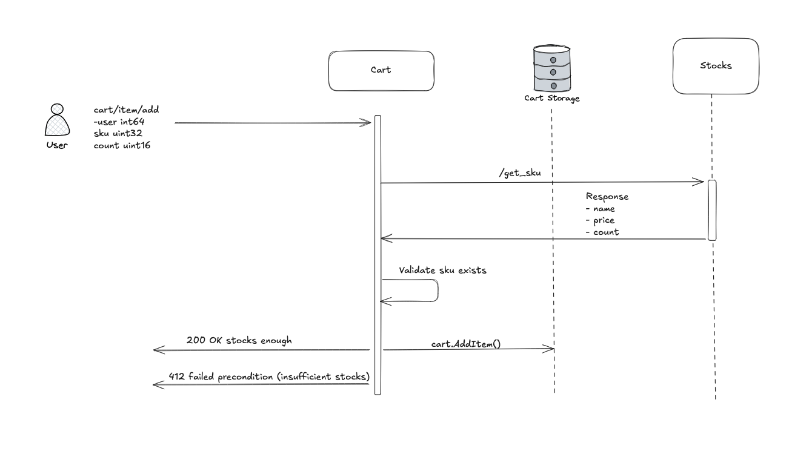
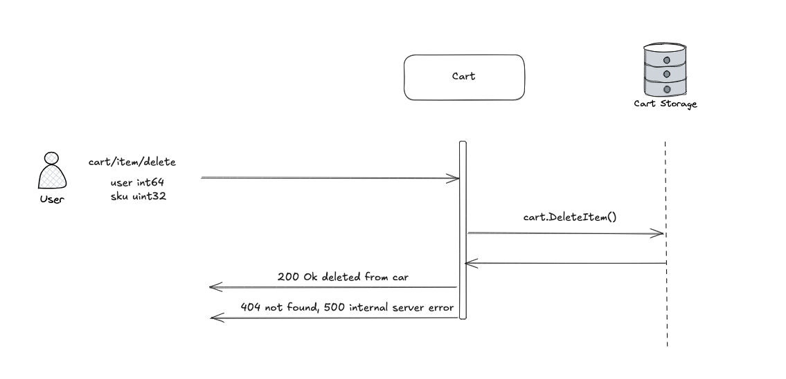
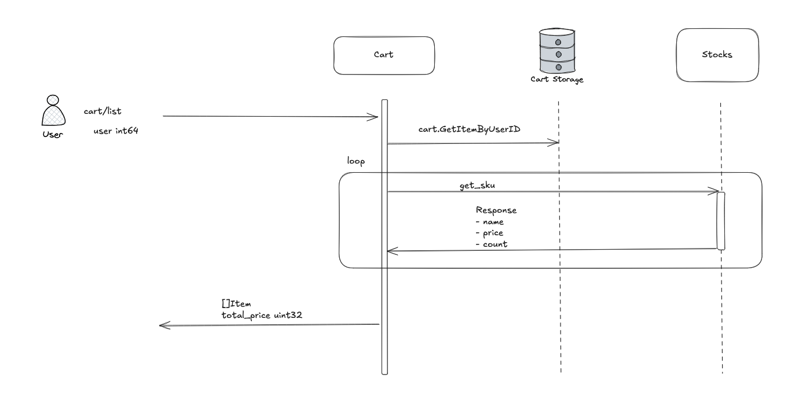
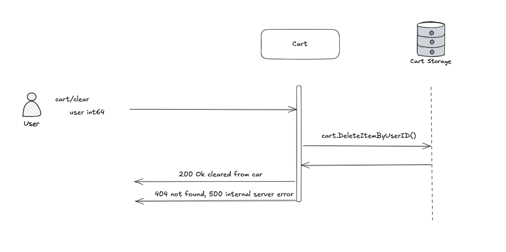

# 🛒 Cart Service

A microservice that manages user shopping carts.

---

## 🚀 Application Ports

Ensure the following ports are accessible. You can change them to free ports in the Docker Compose file if necessary:

- `8070`: Application monitoring
- `8080`: Application gateway (HTTP)
- `8090`: gRPC service
- `5432`: PostgreSQL (internal)

---

## 🧪 How to Run and Test

### ✅ Using Docker Compose

1. Create a Docker network (only once):

```bash
docker network create public-net
```

2. Start the service:

```bash
docker compose up
```

---

## 📬 API Endpoints

> All endpoints use the `POST` method.

### ➕ Add Item to Cart

Adds an item to the user's cart after validating stock availability.

- **Endpoint**: `POST /cart/item/add`

```json
{
  "userId": 1,
  "sku": 1001,
  "count": 1
}
```



---

### ➖ Remove Item from Cart

Removes a specific item (by SKU) from the user's cart.

- **Endpoint**: `POST /cart/item/delete`

```json
{
  "userId": 1,
  "sku": 1001
}
```



---

### 📦 List Cart Items

Returns a list of all items in the user's cart, with real-time prices fetched from the Stocks service.

- **Endpoint**: `POST /cart/list`

```json
{
  "userId": 1
}
```



---

### 🧹 Clear Cart

Removes all items from the user's cart.

- **Endpoint**: `POST /cart/clear`

```json
{
  "userId": 1
}
```



---

## ⚙️ Cart Service Operations Summary

- `POST /cart/item/add`
  Add a specified quantity of an item (by SKU) to the user's cart
  Validations:

  - Item existence
  - Available stock (via Stocks service)

- `POST /cart/item/delete`
  Remove an item (by SKU) from the user's cart

- `POST /cart/list`
  List all cart items

  - Fetch product names and prices in real-time from the Stocks service

- `POST /cart/clear`
  Remove all items from the user's cart
