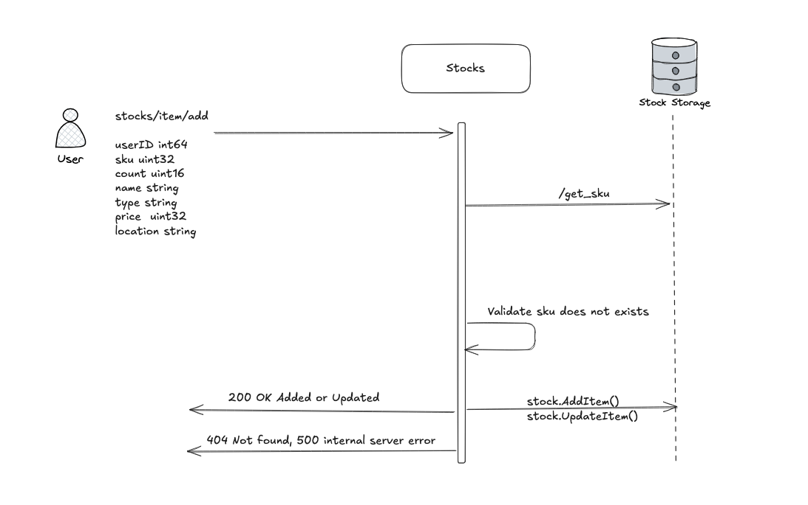
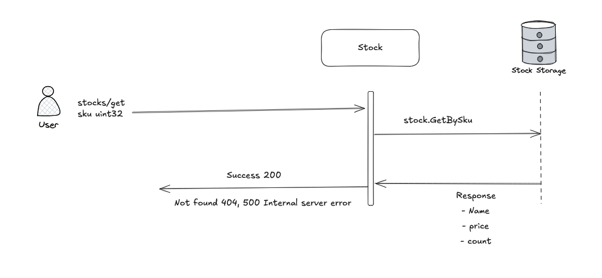
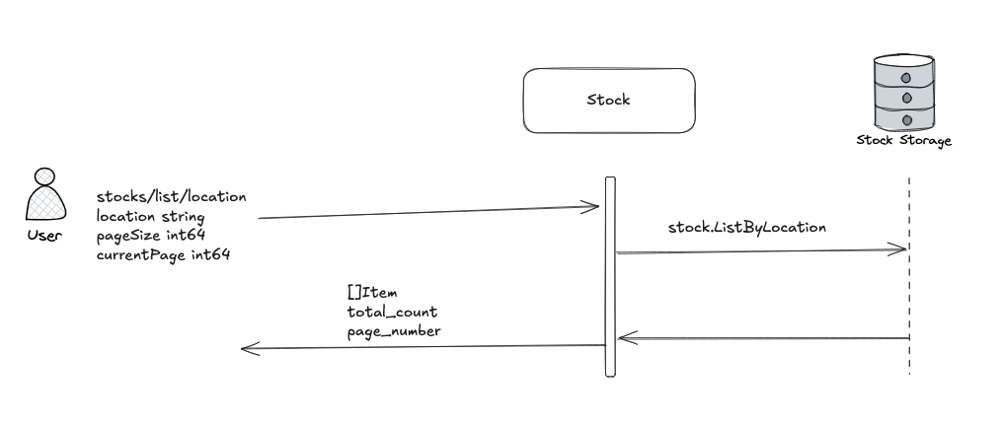
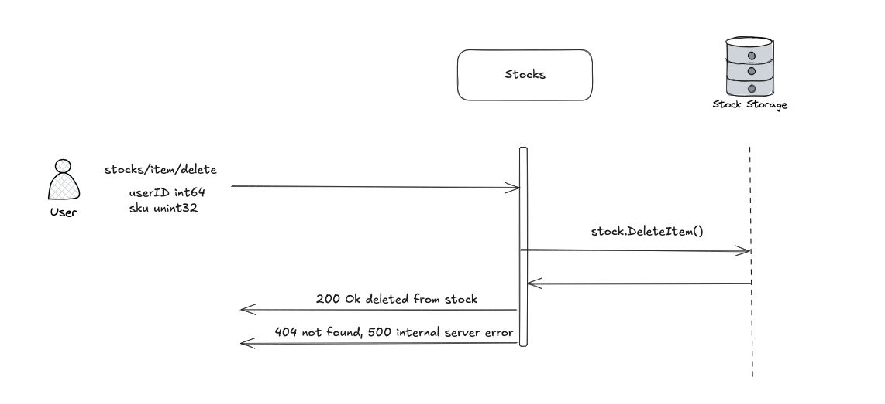

# 📦 Stock Service

Manages inventory availability, pricing, and locations.

---

## 🚀 Application Ports

Ensure the following ports are accessible. You can change them to free ports in the Docker Compose file if necessary:

- `8071`: Application monitoring
- `8081`: Application gateway (HTTP)
- `8091`: gRPC service
- `5433`: PostgreSQL (internal)

---

## 🧪 How to Run and Test

### ✅ Using Docker Compose

1. Create a Docker network (only once):

```bash
docker network create public-net
```

2. Start the service:

```bash
docker compose up
```

---

## 📬 API Endpoints

> All endpoints use the `POST` method.

### ➕ Add Stock

Adds new inventory items.

- **Endpoint**: `POST /stocks/item/add`

```json
{
  "sku": 1001,
  "userId": 1,
  "count": 10,
  "price": 100,
  "location": "AG"
}
```



---

### 📃 Get Item from Stock

Retrieves specific stock item.

- **Endpoint**: `POST /stocks/get`

```json
{
  "userId": 1,
  "sku": 1001
}
```



---

### 📦 List Stock Items By Location

Lists inventory in the stocks with pagination.

- **Endpoint**: `POST /stocks/list`

```json
{
  "userId": 1,
  "location": "AG",
  "pageSize": 1,
  "currentPage": 1
}
```



---

### ➖ Stock Delete

Removes inventory items from the stocks.

- **Endpoint**: `POST /stocks/item/delete`

```json
{
  "userId": 1,
  "sku": 1001
}
```



## ⚙️ Stocks Service Operations Summary

- `POST stocks/item/add`
  - Add new stock items to the catalog.
- `POST stocks/item/delete`
  - Remove a stock item (by SKU) from the catalog.
- `POST stocks/list`
  - List stock items filtered by location with pagination support.
- `POST stocks/get`
  - Retrieve detailed information about a specific stock item (by SKU).
